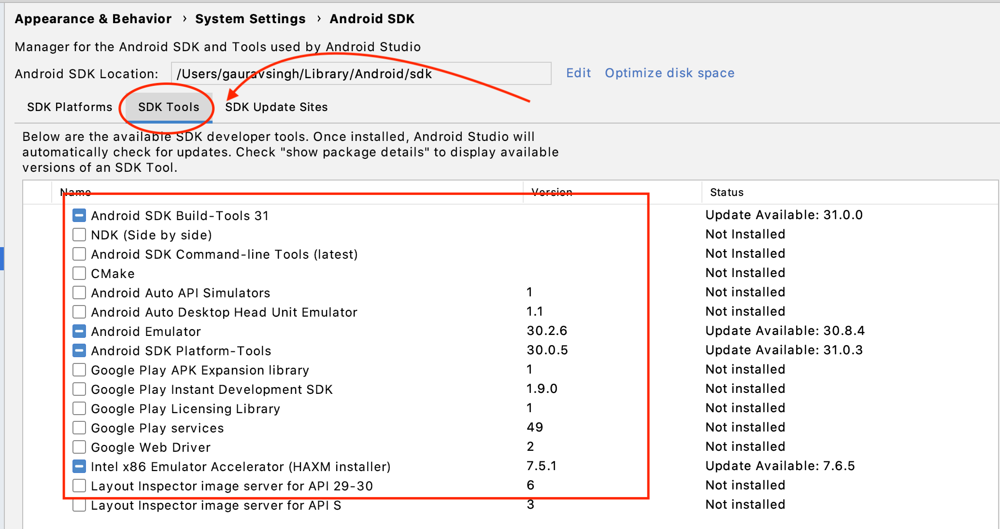

# Setup libraries

## Step 1: Install homebrew

- We'll need it to install `npm` and `node`
- [Install instructions](https://docs.brew.sh/Installation)

On macOS

```zsh
/bin/bash -c "$(curl -fsSL https://raw.githubusercontent.com/Homebrew/install/master/install.sh)"
```

> On Linux or WSL (Windows subsystem for linux): You may need to install
> [linuxbrew](https://docs.brew.sh/Homebrew-on-Linux)

## Step 2: Install node

- [Instructions](https://nodejs.org/en/download/)
- Download and install node (10+) for your platform
  > Prefer choosing LTS (Long term support version)

On macOS:

```zsh
brew install node
```

- Verify running below command returns version:

```zsh
➜  appium-fast-boilerplate git:(main) node -v
v14.14.0
```

And verify for npm as well

```zsh
➜  appium-fast-boilerplate git:(main) npm -v
6.14.8
```

## Step 3: Install Appium server

Run below command:

```zsh
npm install -g appium
```

> - 🔺 Do not use `sudo` to install appium server
> - `-g` indicates that this package would be
>   [installed globally](https://docs.npmjs.com/downloading-and-installing-packages-globally)

Verify appium server is installed

```zsh
➜  appium-fast-boilerplate git:(main) appium
[Appium] Welcome to Appium v1.17.0
[Appium] Appium REST http interface listener started on 0.0.0.0:4723
```

You will see all server logs in this terminal window.

## Step 4: Install Android Studio

- We need command line tools like **adb, emulators** etc to work with android
- Easiest way is to download and install [Android studio](https://developer.android.com/studio)
- Once installed make sure SDK tools are installed via SDK manager




Add below environment variables:

- On Mac/Linux: In `.bash_profile` or `.zshrc` (followed by running `source .zshrc`)
- On Windows: Add them in your System environments variables on Windows

```zsh
export ANDROID_HOME=$HOME/Library/Android/sdk
export PATH=$ANDROID_HOME/emulator:$PATH
export PATH=$ANDROID_HOME/tools:$PATH
export PATH=$ANDROID_HOME/platform-tools:$PATH
export PATH=$ANDROID_HOME/tools/bin:$PATH
```

Verify `adb` (android debug bridge) is installed

```zsh
➜  appium-fast-boilerplate git:(main) adb
Android Debug Bridge version 1.0.41
Version 30.0.5-6877874
Installed as /Users/gauravsingh/Library/Android/sdk/platform-tools/adb
```

## Step 5: Install Java and set JAVA_HOME

Either install Java from oracle site or the OpenJDK version

- [Oracle download site](https://www.oracle.com/in/java/technologies/javase-downloads.html)
- [Open jdk](https://adoptopenjdk.net/?variant=openjdk8&jvmVariant=hotspot)

On macOS:

```zsh
brew install openjdk@8
sudo ln -sfn /usr/local/opt/openjdk@8/libexec/openjdk.jdk /Library/Java/JavaVirtualMachines/openjdk-8.jdk
```

Add JDK home path as `JAVA_HOME` variable

```zsh
export JAVA_HOME=/Library/Java/JavaVirtualMachines/openjdk-8.jdk/Home
export PATH=$JAVA_HOME/bin:$PATH
```

---

> 🥳 Milestone: Congratulations! We've setup everything for android tests! Let's setup iOS as well.
> 😉

## Step 6: Install [carthage](https://github.com/Carthage/Carthage)

- Allows to add frameworks to Cocoa applications, allows to build dependencies

```zsh
brew install carthage
```

## Step 7: Verify dependencies are installed with Appium Doctor

- Appium doctor is a CLI that provides insights on what dependencies are missing as well as how to
  install them
- Make sure all required dependencies are installed

```zsh
npm install -g appium-doctor
```

Run:

```zsh
# For both android and iOS
appium-doctor
# For only android
appium-doctor --android
# For only iOS
appium-doctor --ios
```

For example:

If I run it at this point of time, it intelligently warns me about below:


## Step 8: Optional iOS dependencies

### IDB (iOS Device bridge)

[Instructions](https://github.com/appium/appium-idb)

```zsh
brew tap facebook/fb
brew install idb-companion
pip3.6 install fb-idb
```

## References

- [Getting started](http://appium.io/docs/en/about-appium/getting-started/index.html#getting-started)
