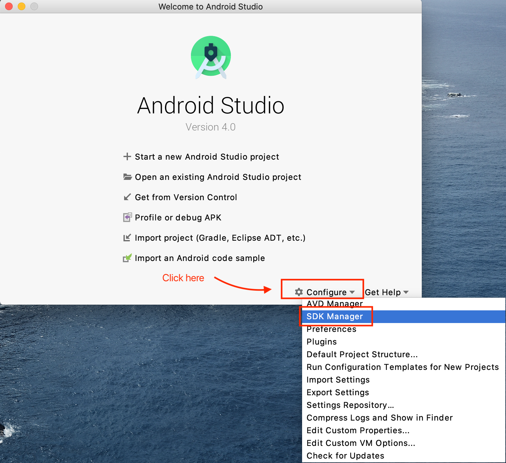
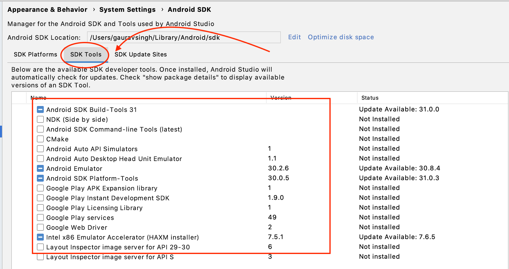

# Setup for Android

## Step 1: Install Android Studio

- We need command line tools like **adb, emulators** etc to work with android
- Easiest way is to download and install [Android studio](https://developer.android.com/studio)
- Once installed make sure SDK tools are installed via SDK manager





Add below environment variables:

- On Mac/Linux: In `.bash_profile` or `.zshrc` (followed by running `source .zshrc`)
- On Windows: Add them in your System environments variables on Windows

```zsh
export ANDROID_HOME=$HOME/Library/Android/sdk
export PATH=$ANDROID_HOME/emulator:$PATH
export PATH=$ANDROID_HOME/tools:$PATH
export PATH=$ANDROID_HOME/platform-tools:$PATH
export PATH=$ANDROID_HOME/tools/bin:$PATH
```

Verify `adb` (android debug bridge) is installed

```zsh
➜  appium-fast-boilerplate git:(main) adb
Android Debug Bridge version 1.0.41
Version 30.0.5-6877874
Installed as /Users/gauravsingh/Library/Android/sdk/platform-tools/adb
```