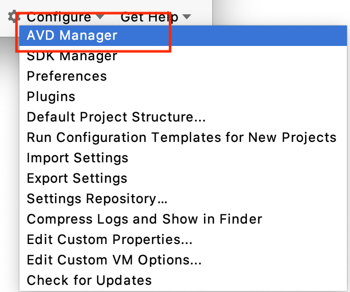
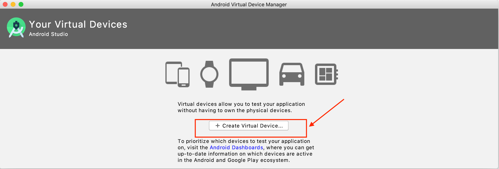
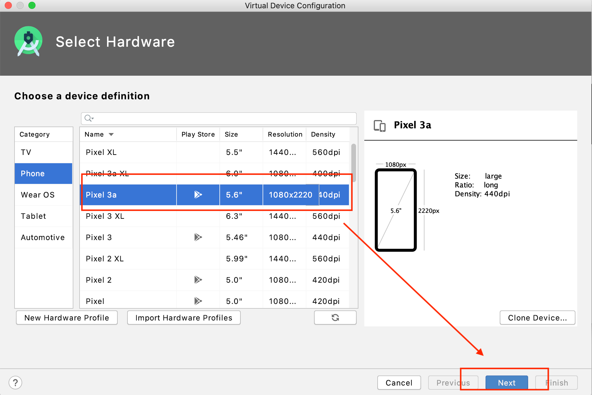
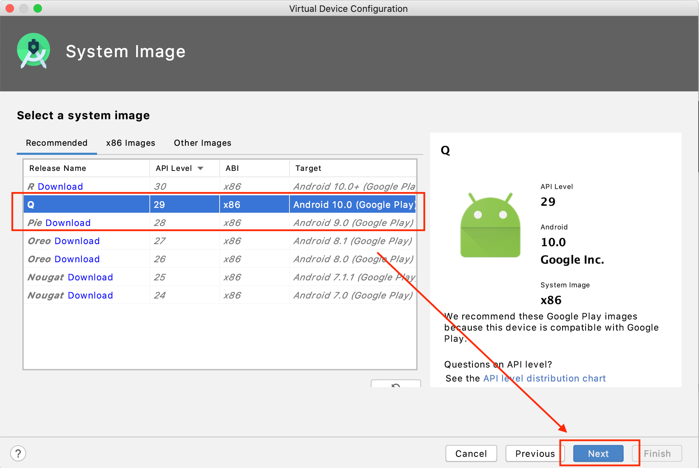
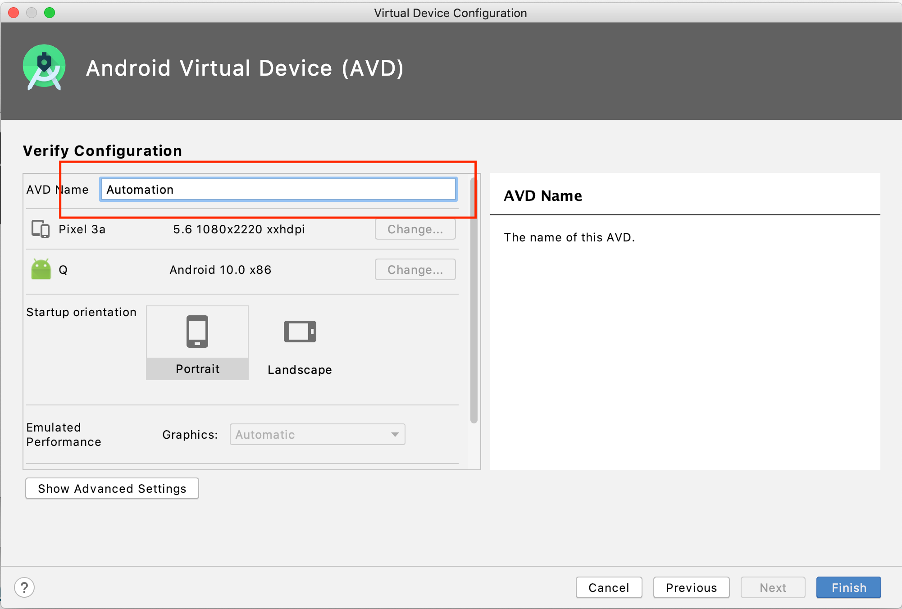
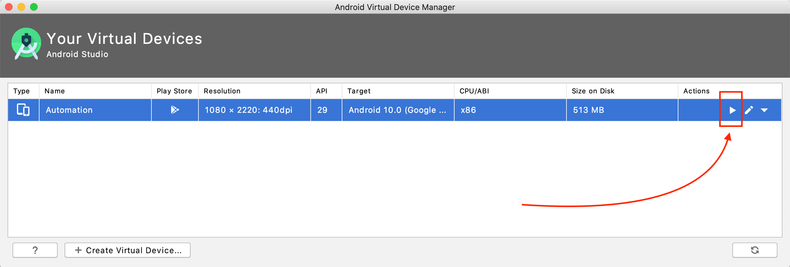
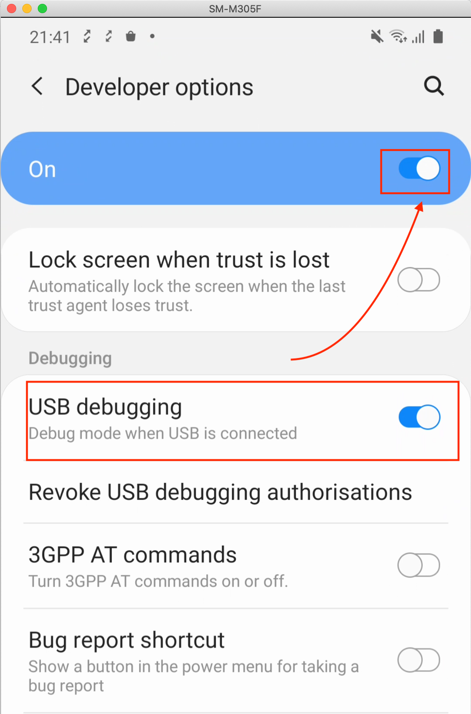

# Setup android emulator or real device

## Setting up emulator

Let's launch our first emulator

Open android studio > Click configure > Click on AVD Manager

Create new emulator

Select a base emulator image model

> Tip: Choose image that have play store option enabled

Select android version, download the appropriate version for your test

Give the emulator a name

Play and start your emulator

## Setting up real device

- Easiest setup is to connect your real device via USB
- Go to About phone
- Tap on Android build number multiple times until developer mode is enabled
- Go to Developer Options and **Enable USB debugging**

