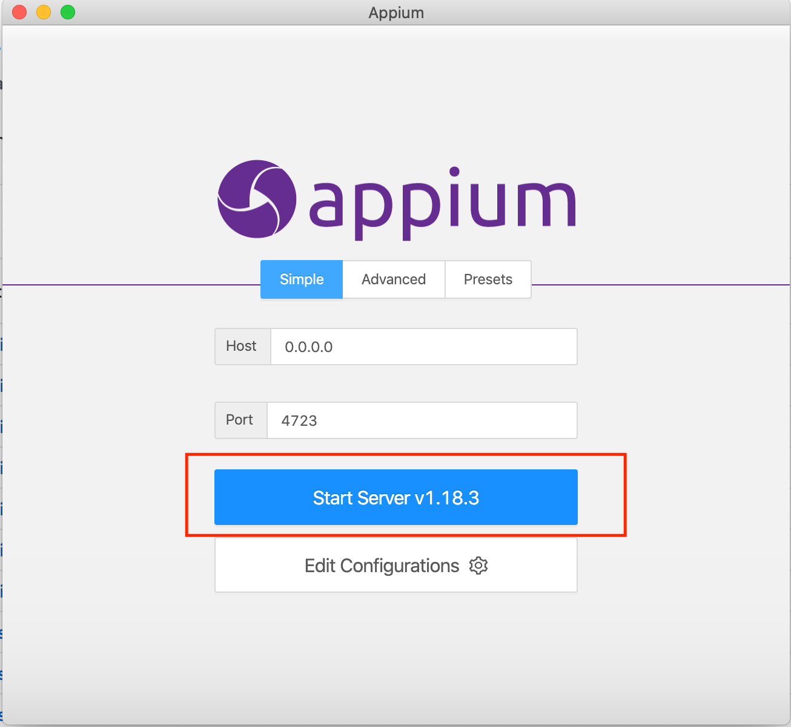
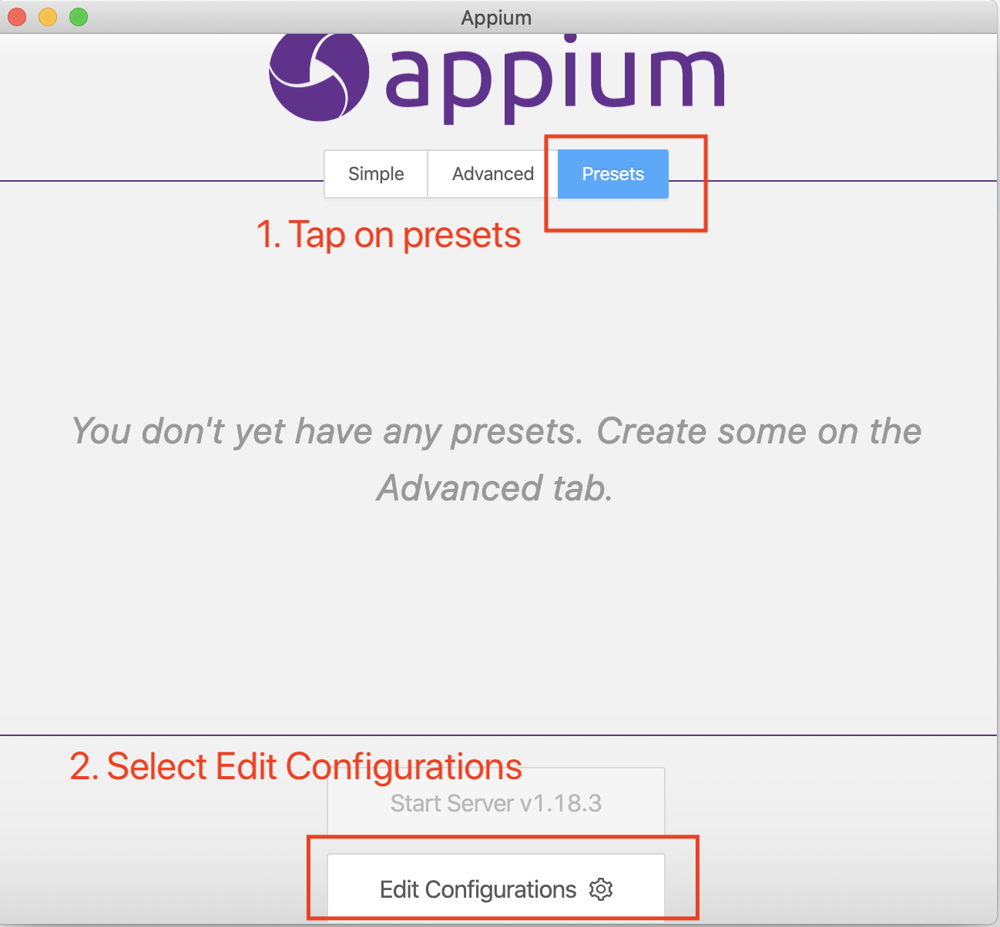
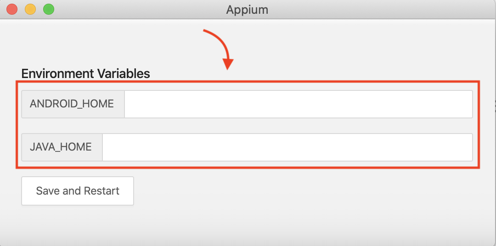
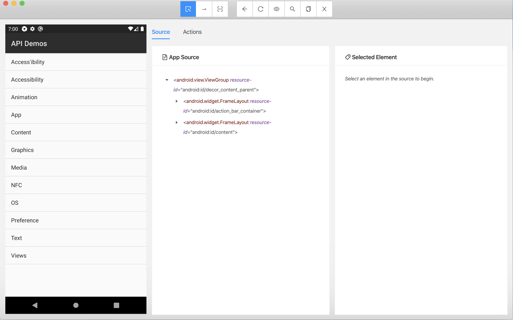

# Appium Desktop 🖥️

## Step 1: Download appium desktop

[Appium desktop github releases](https://github.com/appium/appium-desktop/releases/tag/v1.21.0) for
your platform

## Step 2: Click on Start server



Verify server started correctly


## Step 3: Adding Java and Android home

Select Presets > Edit Configuration



Add paths to `JAVA_HOME` and `ANDROID_HOME` variables

On mac

```zsh
echo $JAVA_HOME
echo $ANDROID_HOME
```



## Step 4: Adding capabilities

- Add capabilities JSON and then save it
- Also Save As with a familiar name


Sample capabilities

### Android

```json
{
	"platformName": "android",
	"automationName": "uiautomator2",
	"platformVersion": "10",
	"deviceName": "Automation",
	"app": "/<absolute_path_to_project>/src/test/resources/ApiDemos-debug.apk",
	"appPackage": "io.appium.android.apis",
	"appActivity": "io.appium.android.apis.ApiDemos"
}
```

> To find `appPackage` or `appActivity`, you can follow a blog I wrote earlier
> [Finding out package and activity name via adb for appium automation ](https://automationhacks.io/2020/04/24/finding-out-package-and-activity-name-via-adb-for-appium-automation/)

### iOS

```json
{
	"platformName": "iOS",
	"automationName": "XCUITest",
	"deviceName": "iPhone 12 Pro Max",
	"app": "/<absolute_path_to_project>/src/test/resources/TestApp.app.zip"
}
```

## Step 5: Launch Appium Desktop to start investigating


