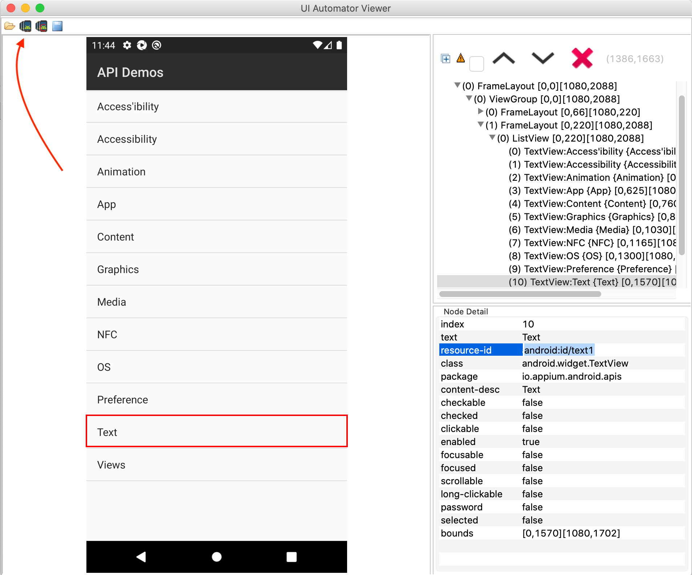

# Bonus tools

## Screen share on android

[Scrcpy from Genymobile](https://github.com/Genymobile/scrcpy)

```zsh
brew install scrcpy
brew install android-platform-tools
```

## Android UIAutomatorViewer

> On Android, you can use `uiautomatorviewer` to also capture the app XML tree to find suitable
> locators

Launch it by running below from your terminal

```zsh
/Library/Android/sdk/tools/bin/uiautomatorviewer/
```



## ADB Commands

Read
[Using adb and cmdline to ease android app testing](https://automationhacks.io/2020/06/11/using-adb-and-cmdline-to-ease-android-app-testing/)

## Macaca App Inspector

[Macaca](https://macacajs.github.io/app-inspector/guide/install.html) is an alternate app inspector
to Appium Desktop

```zsh
npm install macaca-cli -g
macaca doctor
npm install app-inspector -g
```
